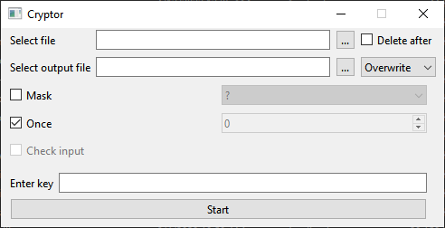

## Cryptor:

## Краткое описание
- **Input | Output**
  - **Select file ** — Выбор входного файла.
  - **Delete after ** — Удаление входного файла после шифровки.
  - **Select output file** — Выбор директории, где будет сохранён конечный файл.
  - **Overwrite ** — _Выпадающий_ _список_ с выбором возможности сохранения конечного файла.
  
- **Once**
  - **Once ** — Выбор _единоразовой_ работы программы или же _работы_ _по_ _таймеру_ (1 ед. == 1 минута).
  - **Check input ** — Проверка заполнения полей по таймеру.
  
- **Key**
- **Enter key ** — Ключ по которому будут шифроваться данные.